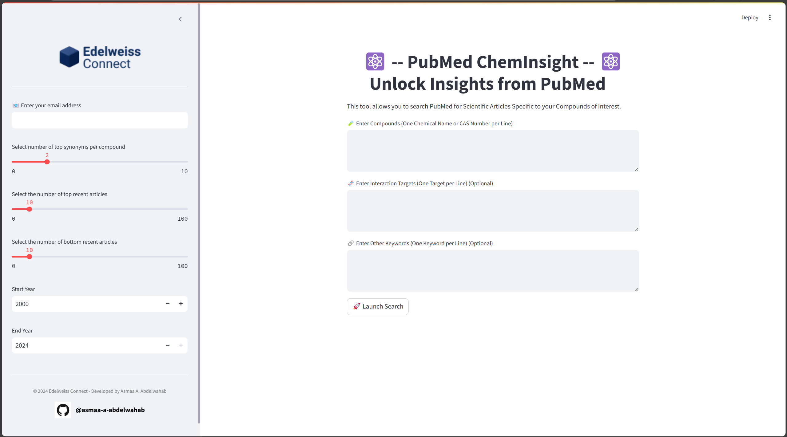

# ⚛️ PubMed ChemInsight: Unlock Insights from PubMed ⚛️ 
[](https://creativecommons.org/licenses/by-nc/1.0/)

**PubMed ChemInsight** is an advanced **Streamlit-based** application designed for researchers to efficiently **retrieve, analyze, and explore scientific literature** related to their **compounds of interest**. It allows querying **PubMed** while incorporating **interaction targets, compound synonyms, and additional keywords** to refine search results.

## **✨ Features**
- **🔍 Multi-Query Search**: Enter multiple compounds, genes (targets), and additional keywords to refine search results, including interaction types and specific relationships.
- **🧪 Compound Synonyms Expansion**: Fetches compound synonyms from **PubChem** to ensure broader searches.
- **📆 Advanced Filtering**: Search for articles within a **custom year range**.
- **📊 Data Processing & Deduplication**: Uses **Pandas** to clean and filter results, removing duplicates.
- **📄 CSV Export**: Download retrieved PubMed articles as a CSV file.
- **🚀 Fully Automated Workflow**: Optimized for **fast queries and API rate management**.

---

## **🛠️ How It Works**
The app integrates multiple technologies to **retrieve, process, and display** scientific literature:

| **Component**         | **Functionality** |
|----------------------|----------------|
| **NCBI PubMed API**  | Retrieves relevant articles based on user queries. |
| **PubChem API**      | Fetches **compound synonyms** to enhance search results. |
| **Streamlit**        | Provides an interactive UI for input, processing, and visualization. |
| **Pandas**          | Cleans, filters, and structures retrieved data. |
| **Biopython (Entrez)** | Handles PubMed article requests. |
| **Metapub**         | Fetches metadata for PubMed articles efficiently. |

---

## **📥 Installation**

### **Option 1: Local Installation**
1. **Clone the Repository:**
   ```bash
   git clone https://github.com/your-repository/pubmed-cheminsight.git
   cd pubmed-cheminsight
   ```

2. **Create a Virtual Environment:**
   ```bash
   python -m venv venv
   source venv/bin/activate  # On Windows: venv\Scripts\activate
   ```

3. **Install Dependencies:**
   ```bash
   pip install -r requirements.txt
   ```

4. **Run the App:**
   ```bash
   streamlit run app.py
   ```

---

### **Option 2: Running with Docker**
1. **Build the Docker Image:**
   ```bash
   docker build -t pubmed-cheminsight .
   ```

2. **Run the Docker Container:**
   ```bash
   docker run -p 8501:8501 pubmed-cheminsight
   ```

3. **Access the App:**  
   Open a browser and go to:  
   👉 `http://localhost:8501`

---

## **🚀 Usage**
1. **Start the Application** (`streamlit run app.py` or launch Docker).
2. **Input Section:**
   - **🧪 Compounds:** Enter compounds (one per line).
   - **🧬 Genes (Targets):** *(Optional)* Enter genes/targets (one per line).
   - **🔗 Additional Keywords:** *(Optional)* Provide keywords to refine the search.
3. **Configure Settings:**
   - Adjust the **number of synonyms**, **date range**, and **number of articles** using the sidebar.
4. **Launch Search:** Click **"🚀 Launch Search"**.
5. **View & Export Results:**  
   - Results appear in a **tabular format**.
   - Download the data as **CSV**.

---

## **📷 Screenshots**
### **1️⃣ Application Input Page**


### **2️⃣ Search Results Page**


---

## **📦 Dependencies**
This project requires **Python 3.7+** and the following libraries:

| 📦 Dependency | 🔧 Function |
|--------------|------------|
| `streamlit`  | UI & Web framework |
| `requests`   | API calls to PubChem & PubMed |
| `pandas`     | Data processing & structuring |
| `biopython`  | NCBI Entrez interface |
| `metapub`    | PubMed metadata retrieval |

**Install all dependencies with:**
```bash
pip install -r requirements.txt
```

---

## **🐳 Docker Setup**
This app can be run inside a **Docker container** for **better portability**.

### **1️⃣ Build the Docker Image**
```bash
docker build -t pubmed-cheminsight .
```

### **2️⃣ Run the Container**
```bash
docker run -p 8501:8501 pubmed-cheminsight
```

### **3️⃣ Access the App**
Go to 👉 `http://localhost:8501`

#### **📌 Dockerfile Overview**
- Uses **Python 3.9 Slim** base image.
- Sets up a **virtual environment** inside the container.
- Installs dependencies **from `requirements.txt`**.
- Exposes port `8501` for Streamlit.

---

## **🛠️ Contribution**
Feel free to **fork the repository** and submit **pull requests**.  
If you encounter issues, create a **GitHub issue** in the repository.

---

## **📞 Contact**
For questions or feedback, contact the developer:

[](https://github.com/asmaa-a-abdelwahab)